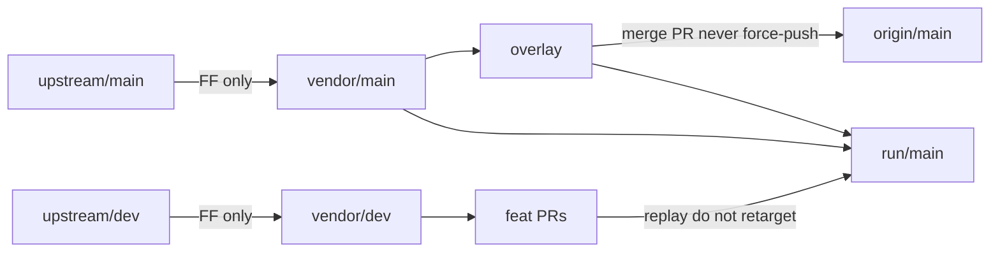

# Fork daily main pin Implementation Plan

> **For agentic workers:** REQUIRED SUB-SKILL: Use superpowers:subagent-driven-development (recommended) or superpowers:executing-plans to implement this plan task-by-task. Steps use checkbox (`- [ ]`) syntax for tracking.

**Goal:** Retarget the public fork’s daily base from `upstream/dev` to released `upstream/main`, keeping the fork overlay on the release pin and replaying selected open feature PRs only onto disposable `run/main`.

**Architecture:** Maintain separate fast-forward-only `vendor/main` and `vendor/dev` lanes. Keep `origin/main` release-plus-overlay, while rebuilding `run/main` from the release pin, overlay, and selected upstream feature heads.

**Tech Stack:** Git branches and worktrees, Markdown documentation, Bun-native TypeScript repository checks.

## Global Constraints

- Never force-push `origin/main`. Never `git merge -X ours` / `-X theirs`. Never `git config`.
- Never open an upstream PR from `origin/main`, `overlay`, or `run/main`; `feat/*` stay based on `vendor/dev` and target `lidge-jun/opencodex` `dev`.
- `vendor/main` is fast-forward-only from `upstream/main`; `vendor/dev` is fast-forward-only from `upstream/dev` and is not merged into `origin/main`.

---

# Fork daily pin to released main

I'm using the writing-plans skill. After you approve this plan, the coordinator writes it to [`docs/superpowers/plans/2026-08-21-fork-daily-main-pin.md`](docs/superpowers/plans/2026-08-21-fork-daily-main-pin.md) and executes with **subagent-driven development**. Every implementer and reviewer uses **`gpt-5.6-luna-high`**. Parallel orchestration is **only** for disjoint files in isolated worktrees; git history work stays serial (SDD forbids two implementers committing on the same checkout).

Spec: [`docs/superpowers/specs/2026-08-21-fork-daily-main-pin-design.md`](docs/superpowers/specs/2026-08-21-fork-daily-main-pin-design.md). Overlay/seam rules stay in [`docs/superpowers/specs/2026-08-21-fork-sync-design.md`](docs/superpowers/specs/2026-08-21-fork-sync-design.md).

## Global constraints

- Never force-push `origin/main`. Never `git merge -X ours` / `-X theirs`. Never `git config`.
- Never open an upstream PR from `origin/main`, `overlay`, or `run/main`. `feat/*` stay based on `vendor/dev` and keep targeting `lidge-jun/opencodex` `dev`.
- `vendor/main` is FF-only of `upstream/main`. `vendor/dev` is FF-only of `upstream/dev` and is **not** merged into `origin/main`.
- Humans land `origin/main`. Agents open the overlay PR; they do not `gh pr merge` it.
- Drop a `feat/*` from `run/main` only when it is in **`vendor/main`**, not merely on `vendor/dev`.
- Lab/fork boundary: `src/router.ts`, `src/server/lifecycle.ts`, `src/server/responses/core.ts` must not import `src/fork/`. Keep one synchronous `registerFork()` in `src/server/index.ts` immediately after Lab activation.
- Do not commit `.cursor/skills/getting-opencodex-prs-review-ready/` (untracked, out of scope).
- Bun at `/Users/user/Projects/opencodex/node_modules/.bin/bun`. `gh` via `/opt/homebrew/bin/gh`.

## Target lanes



Public default stays `main` on `yansigit/opencodex`. Daily checkout becomes `run/main`. `run/dev` is retired as daily (leave the branch; do not delete unless asked).

## Files

- Amend [`docs/fork/README.md`](docs/fork/README.md) — pin `upstream/main`; add `vendor/main`; `run/main` rebuild; `vendor/dev` only for `feat/*`.
- Amend [`docs/fork/OWNED.md`](docs/fork/OWNED.md) — three-way **theirs** = `vendor/main`.
- Amend [`.cursor/skills/opencodex-fork-sync/SKILL.md`](.cursor/skills/opencodex-fork-sync/SKILL.md) — commands and YAML description; keep Luna/Composer workers; never open upstream PRs from `run/main`.
- Amend [`docs/fork/MIXED-SPLIT.md`](docs/fork/MIXED-SPLIT.md) — overlay vs `vendor/main`; replay on `run/main` not `run/dev`.
- Git only: `vendor/main`, rebase `overlay`, overlay PR into `origin/main`, rebuild `run/main`. No runtime code unless the `index.ts` seam conflicts on rebase.

## Wave 1 — parallel Luna docs (disjoint worktrees)

Controller: `git fetch upstream origin --prune`. Create three worktrees from current `overlay` (`815d27634` plus any Wave-0 plan commit):

- `.worktrees/pin-readme`
- `.worktrees/pin-owned`
- `.worktrees/pin-skill`

Dispatch **three** Luna implementers in one turn. Each edits **one** path, commits `fork: …` on its worktree, writes `.superpowers/sdd/task-N-report.md`. Then one Luna reviewer per task (or one docs-wave reviewer after coordinator copies commits onto `overlay`).

**Task 1 — README** ([`docs/fork/README.md`](docs/fork/README.md)):

- Remotes: `upstream` integration source remains `dev` for PRs; **daily pin** is `upstream/main`.
- Lanes: `vendor/main` (FF `upstream/main`); `vendor/dev` (FF `upstream/dev`, feat only); `overlay` on `vendor/main`; `origin/main` = overlay via merge PR; `run/main` disposable daily driver; `run/dev` not daily; `sync/upstream-*` merges `vendor/main` into `origin/main`.
- Sync snippet: FF `vendor/main` to `upstream/main`; also FF `vendor/dev`; `git merge --no-ff vendor/main` into sync branch from `origin/main`. Cadence: when `upstream/main` moves, not daily `dev` chase.
- Rebuild `run/main`: reset to `vendor/main`, apply overlay, merge PR heads in order, `git push --force-with-lease origin run/main`. Stop including a feat once it is in `vendor/main`.
- Link the new spec. Never force-push `main`.

**Task 2 — OWNED** ([`docs/fork/OWNED.md`](docs/fork/OWNED.md)):

- Change only the merge sentence: **ours** = `origin/main` (or `main`); **theirs** = `vendor/main`.
- Path classes unchanged (`src/fork/**`, google/responses/core hotspots).

**Task 3 — skill + MIXED-SPLIT**:

- Skill YAML description: mention `vendor/main`, overlay, `run/main`.
- Replace sync commands with `vendor/main` / `origin/main`. Keep `vendor/dev` FF in the same fetch, labeled PR-base only.
- Rebuild section becomes `run/main`. Forbidden upstream PR sources include `run/main`.
- [`docs/fork/MIXED-SPLIT.md`](docs/fork/MIXED-SPLIT.md): `git log vendor/main..overlay`; FEAT-ONLY lives on GitHub `feat/*` and is replayed onto `run/main`; do not require local feat branches.

Coordinator cherry-picks the three worktree commits onto `overlay` (or fast-forwards if linear). Remove worktrees. Ledger: `.superpowers/sdd/progress.md`.

## Wave 2 — sequential git pin (one Luna)

**Task 4 — `vendor/main` + rebase overlay**

```bash
git fetch upstream origin --prune
git branch vendor/main upstream/main   # or FF if it exists
git merge --ff-only upstream/main      # while on vendor/main
git checkout overlay
git rebase vendor/main
```

If `src/server/index.ts` conflicts: keep one synchronous `registerFork()` immediately after the Lab activation block. Do not drop `src/fork/` or tests.

Verify:

```bash
git merge-base --is-ancestor vendor/main overlay   # must be true
git log --oneline vendor/main..overlay             # only fork: commits
bun test tests/fork/register.test.ts tests/core-lab-boundary.test.ts
```

If rebase rewrites commits, force-push `overlay` only if it already has an `origin` upstream; otherwise first push is `git push -u origin overlay`. Never force-push `main`.

## Wave 3 — sequential `run/main` replay (one Luna)

**Task 5 — rebuild `run/main`**

Fetch PR heads from `origin` (local feat branches were deleted):

- #2068 `origin/feat/antigravity-quota-geoblock`
- #2070 `origin/feat/antigravity-cca-wire`
- #2071 `origin/feat/antigravity-host-failover`
- #2069 `origin/feat/antigravity-account-cooldown`
- #2257 `origin/feat/subagent-roles-config` then `origin/feat/subagent-roles-gui` then `origin/feat/subagent-roles-sync` (GUI/sync are stacked; include them so the daily tree matches what we already ran)

```bash
git checkout -B run/main overlay
# overlay already has vendor/main + fork: commits after Task 4
git merge origin/feat/antigravity-quota-geoblock
git merge origin/feat/antigravity-cca-wire
git merge origin/feat/antigravity-host-failover
git merge origin/feat/antigravity-account-cooldown
git merge origin/feat/subagent-roles-config
git merge origin/feat/subagent-roles-gui
git merge origin/feat/subagent-roles-sync
```

Conflicts: resolve on `run/main` only. Do not retarget GitHub PRs. Do not silently omit a merge; write the conflict into the task report. Same hotspot serialization as before (`google*.ts`, `responses/core.ts`). Prefer HEAD failover/HTTPS hosts plus incoming cooldown/quota behavior when both sides changed those files (same intent as the previous `run/dev` rebuild).

Verify (do not claim green without output):

```bash
bun test tests/fork/register.test.ts tests/core-lab-boundary.test.ts tests/antigravity-quota.test.ts
bun run typecheck
```

Add focused tests those PRs already ship if quota is not enough (CCA/google/subagent files from the merge). If typecheck is clean and Antigravity/subagent tests pass, skip full `bun run test` unless a shared runtime file other than the PR diffs changed unexpectedly.

Optional: `git push --force-with-lease origin run/main`. Do **not** merge or force-push `origin/main`.

## Wave 4 — public overlay PR (coordinator + Luna)

**Task 6 — open overlay PR into fork `main`**

`origin/main` is already `v2.29.0` without overlay. After Task 4:

```bash
gh repo view yansigit/opencodex --json defaultBranchRef -q .defaultBranchRef.name
git push -u origin overlay
gh pr create --repo yansigit/opencodex --base main --head overlay \
  --title "fork: overlay playbook on released main" \
  --body "$(cat <<'EOF'
## Summary
- Land fork overlay (`src/fork` seam + docs/skill) on upstream v2.29.0.
- Does not include unreleased Antigravity/subagent PRs (those stay on run/main).

## Verification
- bun test tests/fork/register.test.ts tests/core-lab-boundary.test.ts
EOF
)"
```

Do not `gh pr merge`. Tell the operator the PR URL. After they merge, local `main` should `git fetch origin && git checkout main && git merge --ff-only origin/main`.

## Review

After Waves 1–3, one Luna whole-branch review of `overlay` vs `vendor/main` (docs + seam only) and a short check that `run/main` contains the five PR topics and is based on `vendor/main`. Then finishing-a-development-branch: do not treat this as an **upstream** PR; the only GitHub PR is the fork overlay PR above.

## Execution notes for the coordinator

- Announce: using SDD + parallel agents for Wave 1.
- `scripts/task-brief` / `scripts/review-package` from the SDD skill directory when dispatching.
- Ledger: `.superpowers/sdd/progress.md` (gitignored).
- Model: `gpt-5.6-luna-high` on every Task/fix/review dispatch.
- Use `using-git-worktrees` for Wave 1; do not `move_agent_to_root` onto a worktree for the coordinator (stay on repo root `overlay` until Task 5 switches to `run/main`).
