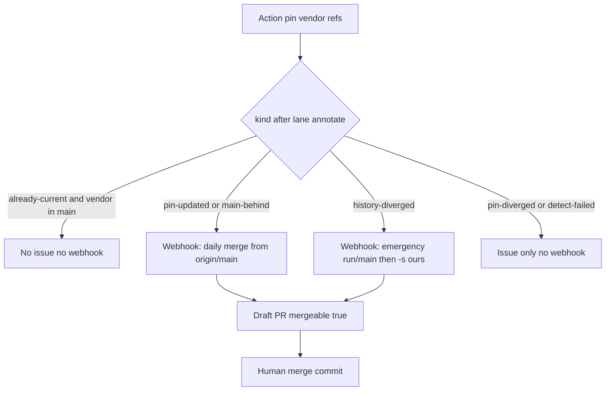

# Fork sync lane health

> **For agentic workers:** REQUIRED SUB-SKILL: Use superpowers:subagent-driven-development. Every implementer and reviewer is **`gpt-5.6-luna-high`**. Fresh subagent per task; review after each task; one whole-branch review at the end. Do not pause between tasks.

**Goal:** Make fork release-sync refuse a disconnected `run/main` rewrite, wake an agent when `origin/main` is still behind a successful pin, and fail a `main` PR that GitHub cannot merge — without auto-merging `main`.

**Architecture:** Keep pin dumb (FF `vendor/*` only). After detect/pin, a new `annotateMainLane` step classifies the relationship between `origin/main` and `vendor/main`. Coordinators receive `main-behind` / `history-diverged` in addition to `pin-updated`. A fork-owned PR check enforces descendant+mergeable. Agents follow the automation prompt: daily merge from `main`, emergency `-s ours` only on `history-diverged`.

**Tech Stack:** Bun TypeScript under `scripts/fork/sync/`, Bun tests under `tests/fork/`, GitHub Actions YAML, Cursor automation prompt.

## Global Constraints

- Fork-only: never open this to `lidge-jun/opencodex`. Land a draft PR into `yansigit/opencodex` `main`.
- Never force-push or auto-merge `origin/main`. Action stays without `pull-requests: write`.
- Never `git config`. Never whole-tree `git merge -X ours` / `-X theirs`. Catch-up `-s ours` remains the documented emergency exception only while `run/main` is checked out.
- Scripts live in `scripts/fork/**`. Tests in `tests/fork/**`. Do not import them from `src/router.ts`, `src/server/lifecycle.ts`, or `src/server/responses/core.ts`.
- TDD: failing test first for each behavior. Do not claim green without command output.
- Workers and reviewers: **GPT 5.6 Luna** (`gpt-5.6-luna-high`). Coordinator may use inherit.
- Do not touch `/Users/user/Projects/opencodex` if it is on `feat/replit-gateway-integration`. Use a worktree from `origin/main` after [#6](https://github.com/yansigit/opencodex/pull/6) is merged; if #6 is still open, branch from `origin/run/main` and restack onto `main` after the catch-up lands.
- Out of scope: editing [`.github/workflows/service-lifecycle.yml`](.github/workflows/service-lifecycle.yml) (macos-launchd already loops 20s; that file is an upstream hotspot). Skill may say `gh run rerun` on timeout-only flakes.

---

## Why (locked)

The dirty Merge button was **history shape**, not one bad hunk. Rebuilding `run/main` from `vendor/main` and PRing into old `main` makes GitHub do a recursive 3-way merge. `vendor not in main` after a pin is **normal** (daily merge pending). Multiple `merge-base --all` results is **emergency**. Silent `already-current` while `main` lacks the pin is the hole that left `main` ~105 behind.



## Files

- New: [`scripts/fork/sync/lane.ts`](scripts/fork/sync/lane.ts), [`tests/fork/sync-lane.test.ts`](tests/fork/sync-lane.test.ts)
- New: [`scripts/fork/sync/contained.ts`](scripts/fork/sync/contained.ts), [`tests/fork/sync-contained.test.ts`](tests/fork/sync-contained.test.ts)
- New: [`.github/workflows/fork-pr-mergeable.yml`](.github/workflows/fork-pr-mergeable.yml), [`tests/fork/sync-pr-mergeable.test.ts`](tests/fork/sync-pr-mergeable.test.ts)
- Edit: [`scripts/fork/sync/types.ts`](scripts/fork/sync/types.ts), [`scripts/fork/sync/cli.ts`](scripts/fork/sync/cli.ts), [`scripts/fork/sync/coordinators/http.ts`](scripts/fork/sync/coordinators/http.ts), [`scripts/fork/sync/notifiers/github-issue.ts`](scripts/fork/sync/notifiers/github-issue.ts)
- Edit: [`.github/workflows/fork-upstream-sync.yml`](.github/workflows/fork-upstream-sync.yml), [`tests/fork/sync-workflow.test.ts`](tests/fork/sync-workflow.test.ts), [`tests/fork/sync-webhook.test.ts`](tests/fork/sync-webhook.test.ts), [`tests/fork/sync-notify.test.ts`](tests/fork/sync-notify.test.ts), [`tests/fork/sync-cli.test.ts`](tests/fork/sync-cli.test.ts)
- Edit docs: [`docs/superpowers/specs/2026-08-22-fork-sync-automation-design.md`](docs/superpowers/specs/2026-08-22-fork-sync-automation-design.md), [`docs/fork/README.md`](docs/fork/README.md), [`docs/fork/OWNED.md`](docs/fork/OWNED.md) (add workflow to fork-owned table), [`.cursor/skills/opencodex-fork-sync/SKILL.md`](.cursor/skills/opencodex-fork-sync/SKILL.md), [`.cursor/skills/opencodex-fork-sync/automation-prompt.md`](.cursor/skills/opencodex-fork-sync/automation-prompt.md)
- Plan copy for SDD ledger: `docs/superpowers/plans/2026-08-22-fork-sync-lane-health.md` (this plan)

Do **not** change [`scripts/fork/sync/detect.ts`](scripts/fork/sync/detect.ts) tag-vs-vendor logic. Lane annotation is a post-step so existing detect queued runners stay valid.

## Lane contract (lock this)

Add to `SyncEvent`:

- `kind` union adds `"main-behind" | "history-diverged"`
- `vendorContainedInMain?: boolean` — `git merge-base --is-ancestor <vendorMain> <mainRef>` exit 0
- `mergeBaseCount?: number` — line count of `git merge-base --all <mainRef> <vendorMain>`
- `recommendedLane?: "noop" | "daily-merge" | "emergency-rebuild"`

`mainRef` default: `HEAD` in the Action (checkout of default branch). If main/vendor missing, leave fields unset and do not change `kind`.

Reclassify only `already-current` and `pin-updated`:

- `mergeBaseCount > 1` → `history-diverged`, `recommendedLane: emergency-rebuild`
- `already-current` and not contained and `mergeBaseCount === 1` → `main-behind`, `recommendedLane: daily-merge`
- `pin-updated` and `mergeBaseCount === 1` → keep `pin-updated`, `recommendedLane: daily-merge`
- `already-current` and contained → keep `already-current`, `recommendedLane: noop`
- Never reclassify `pin-diverged` / `detect-failed`

HTTP/Cursor webhook posts **only** `pin-updated`, `main-behind`, `history-diverged` (extend the `event.kind !== "pin-updated"` guard in [`http.ts`](scripts/fork/sync/coordinators/http.ts)). `pin-diverged` stays issue-only.

Workflow emit today: `kind != 'already-current'`. Keep that; `main-behind` and `history-diverged` will emit. Add a contract test that those strings appear in types/cli tests, not necessarily YAML.

Issue body: include `recommendedLane` and stop saying “rebuild run/main” for daily-merge events. Use “open or update a merge-from-main draft PR”.

## PR mergeable check (lock this)

New workflow, fork-owned, `pull_request` to `main` (not `pull_request_target`, no write token):

- `permissions: { contents: read }`
- Checkout `fetch-depth: 0`
- Fail if `github.event.pull_request.mergeable == false` (dirty)
- If `mergeable == null`, retry a few times then fail closed with “GitHub has not computed mergeability”
- Fail if `git merge-base --is-ancestor origin/${{ github.base_ref }} HEAD` is false (head is not a descendant of base). Recovery text: daily: merge `origin/main` into the sync branch; emergency: `-s ours` on `run/main` only. Never ask the human to resolve GitHub’s 3-way of a disconnected rebuild.
- Do not merge, label, or comment (avoids extra permissions). `core.setFailed` is enough.

Add `fork-pr-mergeable.yml` to the fork-owned table in OWNED.md.

## Absorbed helper (lock this)

`contained.ts`: `isAncestor(runner, commit, intoRef)` wrapping `merge-base --is-ancestor`. `uncontained(runner, commits, intoRef)` returns those that fail. Optional `samePatchId` only if a focused test needs cherry-pick SHA mismatch; otherwise ancestry is enough for the agent prompt.

No README feat-list parser in this PR (YAGNI). Prompt tells the agent to call this helper or the equivalent git commands.

## SDD waves (parallel)

**Wave 1 (parallel, no mutual imports):**

1. **lane-types** — TDD `lane.ts` + types; queued git runner; do not wire cli yet.
2. **contained** — TDD `contained.ts`.
3. **pr-mergeable-workflow** — YAML + `tests/fork/sync-pr-mergeable.test.ts` reading the file like [`tests/fork/sync-workflow.test.ts`](tests/fork/sync-workflow.test.ts).

**Wave 2 (after lane-types; parallel):**

4. **cli-annotate** — `runCli` detect/pin calls `annotateMainLane`; extend [`tests/fork/sync-cli.test.ts`](tests/fork/sync-cli.test.ts) queued results for the two extra git calls; reclassify cases.
5. **plugins** — webhook posts new kinds; issue notifier copy + still skips `already-current`; update [`sync-webhook.test.ts`](tests/fork/sync-webhook.test.ts) / [`sync-notify.test.ts`](tests/fork/sync-notify.test.ts).
6. **workflow-emit** — YAML comments/summary include lane; still no `pull-requests: write`, still no push `main`.

**Wave 3:**

7. **docs-prompt-spec** — spec + README + skill + automation prompt: forbidden `git switch -C run/main vendor/main` unless `history-diverged`; stop only when `gh pr view --json mergeable` is `MERGEABLE`; human merge commit only.

**Then:** whole-branch review (Luna), focused `bun test tests/fork/`, `bun run typecheck`. Draft PR to fork `main`. Do not merge.

Per-task: implementer commits on the feature branch; reviewer uses the SDD review-package flow. Coordinator serializes `google.ts` / `responses/core.ts` if any task would touch them (they should not).

## Verification

```bash
bun test tests/fork/
bun run typecheck
```

Privacy: no new logging of secrets. Contract tests still forbid `gh pr merge` and force-push `main` in the pin workflow.

## Not in this PR

- macos-launchd extra retry overlay
- Extracting more fork code into `src/fork/**`
- Making `enforce-target` a required check (keep it unrequired)
- Auto-clicking Merge
