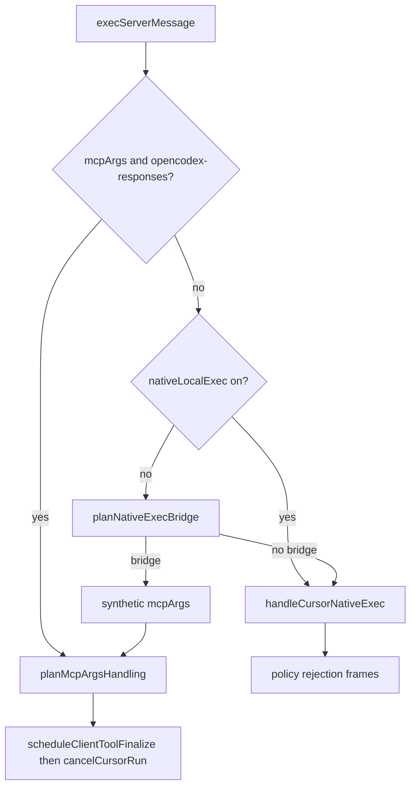

# Cursor Native Exec Bridge Design

## Problem

When `nativeLocalExec` is not `"on"`, Cursor server-driven native exec frames (`shell`, `read`, `ls`, `grep`, `fetch`, and related shell variants) fall through to `handleCursorNativeExec`, which writes policy-rejection native results containing `#604` retry prose (`nativeShellDisabledMessage()`). Cursor continues the same run waiting for a result that already arrived, and the model often retries native tools instead of emitting a Codex `shell_command` or `exec_command` call.

The MCP Responses bridge already does the correct thing for client catalog tools: emit `tool_call_start` / `tool_call_delta` / `tool_call_end`, arm `scheduleClientToolFinalize`, and cancel the Cursor run without writing fake `mcpResult` / `shellResult` frames. Native execs that map to a one-shot shell command should reuse that same path when a bare Codex shell bridge tool is advertised on the turn.

## Architecture

- New pure mapper `src/adapters/cursor/native-exec-bridge.ts` exports `planNativeExecBridge`, `advertisedBareCodexShellBridgeName`, and `nativeExecBridgeToMcpExec`.
- `live-transport.ts` intercepts native exec in `handleServerMessage` after the existing `mcpArgs` / `planMcpArgsHandling` block and before `local_side_effect` / `handleCursorNativeExec`.
- On bridge hit: synthesize `mcpArgs` with `providerIdentifier: "opencodex-responses"`, call `planMcpArgsHandling`, then `noteClientToolActivity`, push events, and `cancelCursorRun` or `scheduleClientToolFinalize`. Return without Connect writes and without marking `local_side_effect`.
- On miss: unchanged policy path through `handleCursorNativeExec`.

## Mapper table

Bridge fires only when all of the following hold:

- `nativeLocalExecEnabled` is false (`cursorUnsafeNativeLocalExecEnabled` false; covers unset, `"off"`, and `"codex-sandbox"`).
- `advertisedShellBridgeName` is a bare catalog name from `CODEX_SHELL_BRIDGE_TOOL_NAMES` (`exec_command` then `shell_command`), taken from `state.clientToolNames` via `normalizeCursorWireName`. Code-mode turns that only expose freeform `exec` do not bridge.
- Exec case is one of: `shellArgs`, `shellStreamArgs`, `backgroundShellSpawnArgs`, `readArgs`, `lsArgs`, `grepArgs`, `fetchArgs`.
- Mapped `command` is non-empty after trim.

Arg mapping:

- `shellArgs` / `shellStreamArgs` / `backgroundShellSpawnArgs`: pass `command` through; copy non-empty `workingDirectory` to `workdir`; drop stream/background semantics.
- `readArgs`: `cat -- ${posixSingleQuote(path)}`
- `lsArgs`: `ls -la -- ${posixSingleQuote(path)}`
- `grepArgs`: `rg -n -- ${posixSingleQuote(pattern)}` plus quoted path when present; ignore glob/context/multiline in this slice.
- `fetchArgs`: `curl -fsSL -- ${posixSingleQuote(url)}`
- `writeArgs`, `deleteArgs`, `writeShellStdinArgs`, computer-use, screen, diagnostics, unknown cases, or empty command/path/url: `{ bridge: false }`.

`posixSingleQuote` wraps in single quotes and replaces `'` with `'\''`.

Synthetic MCP exec matches existing `execMcpArgs` test shape: `providerIdentifier: "opencodex-responses"`, `name` / `toolName` from the advertised bridge name, `toolCallId` from native args or `exec_${execMsg.id}`, and UTF-8 JSON bytes per arg key (`command`, optional `workdir`).

## Turn ending

Reuse the MCP client-tool finalize path exactly. Parallel native execs in one receive window share `CLIENT_TOOL_FINALIZE_GRACE_MS` (and `clientToolFinalizeGraceMsForRequest` expansion). `finalizeAfterDrain` still no-ops if `openToolCalls` reopened. Never write `shellResult`, `readResult`, `lsResult`, `grepResult`, `fetchResult`, or `mcpResult` on a bridged exec.

Continuation is the next `/v1/responses` with `function_call_output` (existing 363 path), not a same-stream native result.

## Tests

- Pure mapper tests in `tests/cursor-native-exec-bridge.test.ts` cover shell/read/ls/grep/fetch mapping, quoting, catalog preference, policy gates, and write/delete refusal.
- Live-transport harness tests prove bridged native exec emits `tool_call_*` events, does not `stream.write` Connect payloads, and does not surface `#604` text; `nativeLocalExec: "on"` and `writeArgs` stay on the native policy path.
- Existing MCP and native-exec regression files must stay green.

## Out of scope

- Mapping write/delete, computer-use, screen, diagnostics, or `writeShellStdinArgs`
- Bridging into code-mode nested `tools.exec(...)`
- Grep glob/context flags, ls ignore list, fetch headers
- Changing `nativeLocalExec` default, max mode, server webSearch/Exa auto-approve
- Antigravity in-turn search, Command Code memory/skills
- New operator config flags

## Windows / POSIX risk

Read/ls/grep/fetch templates use POSIX shell quoting and commands (`cat`, `ls`, `rg`, `curl`). The bridge passes native `shellArgs.command` through unchanged. Codex executes on the client host shell; opencodex does not guess the client OS. Operators on Windows clients must rely on Codex-side adaptation (already documented in `#604` prose for the no-bridge fallthrough).
