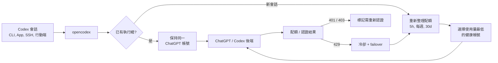

<h3 align="center">make codex open!</h3>
<p align="center"><b>適用於 OpenAI Codex 與 Claude Code 的通用供應商代理</b><br>
兩條命令，Codex 和 Claude Code 就能用任何 LLM 跑起來。</p>

<p align="center">
  <a href="https://x.com/claudeebum"></a>
  <a href="https://www.npmjs.com/package/@bitkyc08/opencodex"></a>
  <a href="https://github.com/lidge-jun/opencodex/blob/main/LICENSE"></a>
  
</p>

```bash
npm install -g @bitkyc08/opencodex
ocx start        # 代理 + 儀表板: localhost:10100
```

<p align="center">
  <br>
  <sub><b>Claude Code 可以用任何模型。</b>選擇器是原生 Claude Code，跑起來的模型隨你選。</sub>
</p>

<p align="center">
  <br>
  <sub><b>Codex 可以用任何模型。</b>選好 provider 直接開跑 —— 同樣的 Codex 工作流，換個大腦。</sub>
</p>

<p align="center">
  <a href="../README.md">English</a> · <a href="README.fr.md">Français</a> · <a href="README.ko.md">한국어</a> · <a href="README.zh-CN.md">简体中文</a> · <b>繁體中文</b> · <a href="README.ru.md">Русский</a> · <a href="README.ja.md">日本語</a> · <a href="README.tr.md">Türkçe</a> · 📖 <a href="https://opencodex.me/zh-tw/"><b>完整文件 →</b></a>
</p>

<p align="center">
  
</p>

在 Codex 中 —— 以及在 **Claude Code** 中 —— 使用 Claude、Gemini、Grok、GLM、DeepSeek、Kimi、Qwen、Ollama 或任意其他 LLM，無需等待官方新增支援。

opencodex 是一個輕量級本機代理，把 Codex 的 Responses API 翻譯成你的 provider 所講的協議。streaming、tool 呼叫、reasoning token、圖片 —— 全部雙向工作。

它還能為 Codex 認證管理一個 **ChatGPT 帳號池**。新增多個 ChatGPT / Codex 帳號，在儀表板中重新整理它們的
5 小時 / 每週 / 30 天配額，並讓新會話自動路由到使用量最低的健康帳號。現有 Codex 執行緒會固定在啟動它的
帳號上，因此長時間的 SSH、tmux 或行動裝置連線的會話不會在對話中途切換帳號。

```
Codex CLI / App / SDK ──/v1/responses──▶ opencodex ──▶ Any provider
                                              │
              Anthropic · Google · xAI · Kimi · Ollama Cloud · Groq
              OpenRouter · Azure · DeepSeek · GLM · …and OpenAI itself
```



## 支援平台

| 作業系統 | 狀態 | 服務管理 |
|---|---|---|
| macOS (arm64 / x64) | 完整支援 | launchd |
| Linux (x64 / arm64) | 完整支援 | systemd（使用者層級） |
| Windows (x64) | 完整支援 | Task Scheduler |

需要 [Node](https://nodejs.org) 18+。Bun 執行環境會在 `npm install` 時自動打包，不必另外安裝。三個平台皆可原生執行（Windows 不需要 WSL）。

## 快速開始

```bash
# 安裝（自動打包 Bun 執行時 —— 只需 Node 18+）
# 建議使用自己的 Node（nvm/fnm）—— 避免使用 `sudo npm install -g …`
npm install -g @bitkyc08/opencodex

# 互動式初始化（寫入設定並注入 Codex）
ocx init

# 啟動代理
ocx start

# 照常使用 Codex —— 請求已由 opencodex 路由
codex "Write a hello world in Rust"
```

<details>
<summary><b>遇到 "bundled Bun runtime is missing" 錯誤 / npm 攔截了 Bun 安裝腳本？</b></summary>

<br/>

opencodex 把 Bun 執行時作為依賴打包，並透過 Node 啟動器執行，因此你**不必**自己安裝 Bun。如果看到 "bundled Bun runtime is missing" 錯誤，代表安裝時略過了 lifecycle 腳本（包括 npm 透過 `allowScripts` 攔截 bun postinstall 的情況）或 optional 依賴。請允許 bun 安裝腳本後再重裝：

```bash
npm install -g --allow-scripts=bun @bitkyc08/opencodex   # 不要加 --ignore-scripts、--omit=optional

# 若一開始用 sudo 安裝，請繼續用 sudo：
sudo npm install -g --allow-scripts=bun @bitkyc08/opencodex
```

npm 警告給的縮寫指令少了套件名，會把目前目錄重裝進去，
請務必明確寫上 `@bitkyc08/opencodex`。

如果之前用 sudo 安裝到了 root 字首，上面的 sudo 重灌可以解除該字首的攔截 ——
但條件允許時建議改用自己的 Node（nvm、fnm 或使用者層級的 npm prefix）。

</details>

## 亮點

- **在 Codex 中使用任意 LLM。** 5 種協議 adapter 覆蓋 Anthropic Messages、Google Gemini、Azure、OpenAI Responses 直通，以及一切 OpenAI 相容 Chat Completions 端點 —— 即開箱即用的 **40+ provider**。
- **在 Claude 中也能使用任意 LLM。** `ocx claude` 可透過代理啟動 Claude Code。Claude 儀表板還提供獨立的 Desktop 配置，可管理 Opus、Fable、Sonnet、Haiku 四個系列，並支援拖放、鍵盤操作和 JSON 匯入/匯出。
- **安全地池化 ChatGPT 帳號。** 現有 Codex 執行緒保持在一個帳號上，而新會話可以從池中自動挑選使用量更低的帳號，並帶有配額重新整理和非 PII 請求標籤。
- **登入一次，不必填 API key。** xAI、Anthropic、Kimi 支援 OAuth，可用現有帳號認證，token 自動重新整理。也可以轉發 `codex login`、貼上 API key，或使用 `${ENV_VAR}` 引用 —— 隨你選擇。
- **Codex 在哪裡能用，它就在哪裡能用。** 自動注入 Codex CLI、TUI、App 和 SDK。路由模型像原生模型一樣出現在 Codex 的模型選擇器裡。
- **委派給合適的模型。** 在儀表板或 config 中把最多 5 個路由/原生模型放進 Codex 的 subagent 選擇器 —— 複雜任務交給 reasoning 模型，快速任務交給便宜模型。在 v2 多智慧體表面（GPT-5.6 Sol/Terra）上，代理會注入精簡的委派指引：首選子智慧體模型與 effort（`injectionModel` / `injectionEffort`）、featured 模型清單及各自支援的 effort 階梯，以及讓跨模型 `spawn_agent` 覆蓋得以應用的 `fork_turns` 規則。已知限制：原生父代理 spawn 路由子代理時，任務本文可能以後端加密形式到達而丟失（[#92](https://github.com/lidge-jun/opencodex/issues/92)）—— 需要可靠的跨 provider 委派請使用 v1 表面。想自訂文案，可在 `injectionPrompt` 中使用 `{{model}}` / `{{effort}}` / `{{roster}}` 預留位置。
- **為 preview-gated OpenAI rollout 做好準備。** GPT-5.6 Sol/Terra/Luna 保留 upstream effort 階梯。Direct/Multi 使用 372k Codex 契約，OpenAI API 與 OpenRouter 使用 1.05M 後設資料。
- **給任意模型超能力。** 非 OpenAI 模型可透過 `gpt-5.4-mini` sidecar（使用你的 ChatGPT 登入）獲得真正的網頁搜尋與圖片理解。
- **原生生成圖片。** Codex 的獨立 `image_gen` 工具透過 `POST /v1/images/generations` 生成圖片、透過 `POST /v1/images/edits` 編輯圖片；它獨立於 hosted Responses 的 `image_generation` 工具。
- **看清正在發生什麼。** Web 儀表板展示 provider、OAuth 狀態、模型選擇和即時請求日誌；當上遊回傳時，也會包含 cached/cache-write token 計數 —— 不用再猜請求為何失敗。
- **背景執行。** 安裝為系統服務（launchd / systemd / Task Scheduler）後開機自啟，無需操心。
- **乾淨退出，零殘留。** `ocx stop`（或儀表板的 Stop 按鈕）會關閉代理、停止已安裝的背景服務，並將 Codex 恢復為原始配置。之後 `codex` 就像從沒安裝過 opencodex 一樣工作 —— 無殘留配置，無殭屍程序。

## 新增供應商

最簡單的做法：用 Web 儀表板。

```bash
ocx gui
```

這會開啟 `http://localhost:10100` 儀表板。在這裡：

1. 點選 **"Add Provider"**。
2. 從 **40+ 內建 provider** 中選擇，或輸入自訂的 OpenAI 相容端點。
3. 貼上 API key（Anthropic、xAI、Kimi 也可用 OAuth 登入）。
4. 模型會從 provider 的 `/v1/models` 端點**自動發現**。

新 provider 立即可用，無需重新啟動。

也可以用 `ocx init`（互動式 CLI）或直接編輯 `~/.opencodex/config.json` 來新增 provider。

## 模型路由

透過 `provider/model` 格式指定路由模型，在 Codex 中直接使用：

```bash
# 透過 Anthropic 使用 Claude Opus
codex -m "anthropic/claude-opus-5" "解釋這個 stack trace"

# 透過 Google 使用 Gemini
codex -m "google/gemini-3-pro" "為 auth.ts 寫單元測試"

# 透過 Ollama Cloud 使用 GLM
codex -m "ollama-cloud/glm-5.2" "寫一個 SQL migration"

# 透過 Ollama 使用本機模型
codex -m "ollama/llama3" "重構這個函式"
```

省略 `provider/` 字首時，opencodex 會路由到預設 provider，或根據模型名模式自動匹配（例如 `claude-*`
路由到 Anthropic，`gpt-*` 路由到 OpenAI）。

路由模型也會出現在 **Codex App** 模型選擇器中，並帶有按模型的 reasoning effort 控制：

目前 Codex 建置在模型宣告支援時可顯示 `low`、`medium`、`high`、`xhigh`、`max` 和 `ultra` reasoning 控制。
除非 provider config 明確設定 alias，opencodex 會把 `xhigh` 與 `max` 保持為不同檔位。`ultra` 與上游
Codex 語義一致：客戶端啟用最大 reasoning 並主動委派多智慧體，實際請求會轉換為 `max` 傳送。
路由模型僅在 provider config 透過 `reasoningEfforts` 顯式開啟時才會宣告 `ultra`。

GPT-5.6 Sol/Terra/Luna 已在 OpenAI API key 和 OpenRouter 預設中作為 rollout-ready 目錄條目預先配置
（`gpt-5.6-sol`、`gpt-5.6-terra`、`gpt-5.6-luna`；OpenRouter 使用 `openai/...`）。
規格與上游 models.json 快照一致 —— Sol/Terra 提供到 `ultra`，Luna 到 `max`，Sol 預設
reasoning 為 `low`。可用性仍受上游
preview gate 限制；opencodex 只是準備好你的帳號/provider 可存取時所需的路由和目錄後設資料。

<p align="center">
  
</p>

## OpenAI 供應商帳號模式

| Provider ID | 路徑 | 憑證 | 行為 |
|---|---|---|---|
| `openai` | Codex 登入 | 主帳號 + 新增的 Codex 帳號 | 預設 Pool，可選 Direct 模式 |
| `openai-apikey` | OpenAI API | API key/key pool | 不做 Codex 帳號路由 |

- Pool 包含主登入和新增的帳號，並應用 affinity、配額、冷卻和 failover。
- Direct 繞過池狀態，只使用目前 caller/主登入 bearer。
- 新安裝和未儲存模式的配置預設使用 Pool。在儀表板 **Providers** 中切換模式時，
  `gpt-5.6-sol` 等 bare 模型 id 保持不變。
- `openai-apikey/gpt-5.6-sol` 選擇 API；Codex 登入與 API 憑證之間不會 fallback。
- 目前 marker 為 `openaiProviderTierVersion: 2`，原配置備份到
  `~/.opencodex/config.json.pre-openai-tiers-v2.bak`。恢復命令：
  `cp ~/.opencodex/config.json.pre-openai-tiers-v2.bak ~/.opencodex/config.json`
- 舊的 v1 三 供應商設定會自動遷移為單一 `openai` 行。
- API 層 GPT-5.6 後設資料為 1,050,000 context / 922,000 max input。
  `gpt-5.6-sol-pro`、`terra-pro`、`luna-pro` 保留公開 virtual id，線上請求改寫為 base id 加
  `reasoning.mode: "pro"`。

### Pool 帳號行為

開啟儀表板中的 **Codex Auth** 來新增池帳號，並選擇由哪個帳號處理下一個 Codex 會話。
opencodex 保持兩種獨立行為：

- **現有會話保持 affinity。** 執行緒 id 綁定到所選帳號並在後續輪次複用，因此長請求或移動/SSH 連線的會話
  會繼續使用同一帳號。
- **新會話可自動路由。** 啟用自動切換後，opencodex 比較 5 小時、每週、30 天使用量中最熱的配額視窗，
  當活躍帳號越過閾值時，為新會話挑選使用量更低的合格帳號。
- **內建配額查詢。** 儀表板可一鍵重新整理所有帳號配額，請求日誌用非 PII 的帳號序號標記池流量。
- **失敗採 fail-closed。** token 失敗會標記需重新認證，而不是悄悄回退到另一個憑證；429 配額回應會讓帳號
  進入冷卻，並可將後續工作 failover 到另一個合格的池帳號。

## 供應商與 adapter

| Provider | Adapter | 認證方式 |
|---|---|---|
| OpenAI（ChatGPT 登入） | `openai-responses` | 轉發（無需 key） |
| OpenAI（API key） | `openai-responses` | key |
| Umans AI Coding Plan | `anthropic` | key |
| Anthropic Claude | `anthropic` | oauth / key |
| xAI Grok | `openai-chat` | oauth / key |
| Kimi（Moonshot） | `openai-chat` | oauth / key |
| Google Gemini | `google` | key |
| Azure OpenAI | `azure-openai` | key |
| Ollama Cloud + 17 家 provider 目錄 | `openai-chat` | key |
| Ollama / vLLM / LM Studio（本機） | `openai-chat` | key（通常留空） |
| 任意 OpenAI 相容端點 | `openai-chat` | key |

此外還有 DeepSeek、Groq、OpenRouter、Together、Fireworks、Cerebras、Mistral、Hugging Face、NVIDIA NIM、MiniMax、Qwen Cloud、騰訊雲 Coding Plan、SiliconFlow 等等。完整清單可用 `ocx init` 檢視，或見[供應商文件](https://opencodex.me/zh-tw/reference/configuration/)。

## CLI

```bash
ocx init                       # 互動式初始化
ocx start [--port 10100]       # 啟動代理
ocx stop                       # 停止並恢復原生 Codex 配置
ocx restore                    # 僅恢復，不停止（別名：ocx eject）
ocx uninstall                  # 移除 service/shim/config 並恢復原生 Codex
ocx ensure                     # 按需啟動 + 重新整理 Codex config/cache
ocx sync                       # 重新整理模型列表 + 重新注入 Codex
ocx status                     # 檢視代理是否在執行
ocx login <provider>          # OAuth 登入（xai、anthropic、kimi、cursor 等）
ocx logout <provider>          # 移除已儲存的登入
ocx account <list|current|use> # 檢視/切換帳號與 API-key pool（脫敏；含 refresh/auto-switch/remove/add-key）
ocx gui                        # 開啟 Web 儀表板
ocx claude [args...]           # 啟動接入代理的 Claude Code（模型發現已開啟）
ocx claude desktop             # 儲存並套用 Claude Desktop 四系列配置
ocx codex-shim install         # 執行 codex 時自動啟動代理
ocx service [install|start|stop|status|uninstall]   # 安裝/更新/啟動背景服務
ocx update [--tag preview]     # 更新 opencodex；preview 安裝保持 @preview
```

### Claude Desktop 配置

儀表板的 **Claude → Desktop** 頁面把路由分為 Opus、Fable、Sonnet、Haiku 四個系列。新路由
預設放入 Opus，第一個 Opus 路由是應用的初始預設模型。每個非空系列都有一個預設路由。你可以
拖動路由，也可以用滑鼠、觸控或鍵盤操作每一行中可見的移動控制元件。點選 **儲存並套用到 Desktop**
後，配置會寫入 Claude Desktop。還可以透過 JSON 匯入/匯出來備份配置，或遷移到另一臺機器。

```bash
ocx claude desktop [apply]                         # 儲存並套用目前設定
ocx claude desktop show [--json]                   # 檢視路由、系列和預設值
ocx claude desktop move <route> <family> [--default]
ocx claude desktop default <family> <route|none>
ocx claude desktop export <path|->                 # 使用 - 將 JSON 輸出到 stdout
ocx claude desktop import <path> [--apply]         # 驗證後儲存，可選擇立即套用
```

`family` 可取 `opus`、`fable`、`sonnet`、`haiku`。非 Anthropic 路由會獲得帶有合成 2026 日期
槽位的穩定 Claude 格式別名；該日期是內部槽位，不是模型釋出日期。真正的 Anthropic Claude
路由保留原始模型 id。`none` 只能用於空系列；非空系列始終需要一個預設值。舊的套用方式
`ocx claude desktop --static`、`--hybrid` 和
`--discovery-only` 仍可使用。

### 自動啟動：service vs shim

opencodex 提供兩種自動啟動代理的方式：

| | `ocx service` / `ocx service install` | `ocx codex-shim install` |
|---|---|---|
| **方式** | OS 服務管理器（launchd / systemd / schtasks） | 包裝 `codex` 腳本啟動器；不會改動真實 `codex.exe` |
| **時機** | 登入後會一直執行 | 按需——只在執行 `codex` 時啟動 |
| **重新啟動** | 崩潰後自動重啟 | 每次執行 `codex` 時啟動一次 |
| **Codex 更新** | 不受影響 | 已穩定的新啟動器若被取代，會在下一道一般 `ocx` 命令中修復 |
| **移除** | `ocx service uninstall` | `ocx codex-shim uninstall` |

若要常駐代理，用 **service**（開發環境建議）。輕量按需啟動則用 **shim**。

如果外部 Codex 更新覆蓋了已安裝的 shim，下一道一般 `ocx` 命令會備份已穩定的新啟動器並恢復
shim。仍在變動中的啟動器不會被改動，會在後續命令重試。修復失敗只會警告，不會讓請求的命令
失敗；手動備援指令為 `ocx codex-shim install`。若要關閉自動還原，請將
`codexShimAutoRestore` 設為 `false`，或為程序設定
`OPENCODEX_CODEX_SHIM_AUTO_RESTORE=0`。
如果配置的代理埠已被佔用，`ocx start` 會自動選擇另一個空閒本機埠並更新 Codex 使用它。

### 解除安裝

移除 npm 套件前，先清掉本機狀態：

```bash
ocx uninstall
npm uninstall -g @bitkyc08/opencodex
```

`ocx uninstall` 會停止代理、移除已安裝的 service、移除 Codex shim、恢復原生 Codex config/catalog/history，並刪除 `~/.opencodex`。

## 設定

配置檔案路徑：`~/.opencodex/config.json`。

**雲端供應商範例：**

```json
{
  "port": 10100,
  "defaultProvider": "anthropic",
  "providers": {
    "anthropic": {
      "adapter": "anthropic",
      "baseUrl": "https://api.anthropic.com",
      "authMode": "oauth",
      "defaultModel": "claude-sonnet-4-6"
    },
    "ollama-cloud": {
      "adapter": "openai-chat",
      "baseUrl": "https://ollama.com/v1",
      "apiKey": "${OLLAMA_API_KEY}",
      "defaultModel": "glm-5.2"
    }
  }
}
```

provider 條目還可以標註路由目錄後設資料。`contextWindow` 設定供應商層級、對 Codex 可見的上下文上限，
`modelContextWindows` 設定按模型的上限，`modelInputModalities` 設定按模型的目錄輸入提示，例如 `["text"]`
或 `["text", "image"]`。這些值只會對即時 `/models` 後設資料設上限，絕不會把更小的即時上下文視窗抬高。內建
GPT-5.6 Sol/Terra/Luna fallback 後設資料會為 OpenAI API key 和 OpenRouter 目錄條目使用 1,050,000 token 的
usable context window；它不會繞過上游 preview access。完整欄位見設定參考。

> **透過 Z.AI 使用 GLM-5.2 1M 上下文：** 在 `openai-chat` adapter 下，`glm-5.2` 和 `glm-5.2[1m]` 都可用 ——
> opencodex 會在傳送請求前剝離末尾的 `[1m]` 字尾，因為 OpenAI 相容端點會拒絕帶方括號的 id（Z.AI 400 code
> 1211）。`[1m]` 字尾是 Claude-Code / Anthropic 端點的約定；若要原生使用，請把 `anthropic` adapter 指向
> Z.AI 的 coding base（`https://api.z.ai/api/coding/paas/v4`）。1M 上下文視窗透過模型目錄
> （`modelContextWindows`）設定，而不是模型名。

**本機供應商範例（Ollama / vLLM / LM Studio）：**

```json
{
  "port": 10100,
  "defaultProvider": "local",
  "providers": {
    "local": {
      "adapter": "openai-chat",
      "baseUrl": "http://localhost:11434/v1",
      "apiKey": "",
      "defaultModel": "qwen3:32b"
    }
  }
}
```

本機 provider 的 `apiKey` 通常留空。只要本機服務有提供 OpenAI 相容的 Chat Completions 端點，opencodex 就能直接接上。

WebSocket 傳輸預設關閉。只有當你希望 Codex 使用 Responses WebSocket 而不是 HTTP/SSE 時，才需要設定 `"websockets": true`。

### 遠端存取

預設 opencodex 會綁定在 `127.0.0.1`（迴環），不必額外認證。
若你設定 `"hostname": "0.0.0.0"` 把代理暴露到區網，opencodex 會要求 bearer token，同時保護管理
API（`/api/*`）和資料平面（`/v1/responses`、`/v1/images/generations`、`/v1/images/edits`）：

```bash
export OPENCODEX_API_AUTH_TOKEN="your-secret-token"
ocx start
```

綁定到非迴環地址時若缺少該環境變數，代理會拒絕啟動。若為區網存取安裝背景服務，請在 `ocx service install`
前，於同一 shell 匯出同一個變數，讓服務管理器收得到。客戶端（腳本、遠端機器）每個請求都必須帶 token：

```
x-opencodex-api-key: your-secret-token
```

token 以常數時間比較，避免時序攻擊。

opencodex 會自動 remap Codex 的 resume 歷史，讓舊的 OpenAI 對話與 opencodex 建立的專案執行緒在代理運作期間仍能在
Codex App 中可見。原始 provider/source 後設資料紀錄在 `~/.opencodex/codex-history-backup.json`。`ocx stop` /
`ocx restore` 會把備份的 OpenAI 列還原到 OpenAI，並把其餘 opencodex 使用者執行緒也 eject 到 OpenAI，讓原生
Codex 不會去 resume 一個供應商已不在 `config.toml` 的執行緒。

若你測過備份功能出現前的舊開發版（`syncResumeHistory` 已經 remap 了歷史），可執行明確的還原命令：

```bash
ocx recover-history --legacy-openai
```

各欄位詳細說明見 **[設定參考](https://opencodex.me/zh-tw/reference/configuration/)**。

## 文件

完整文件——安裝、供應商設定、路由、sidecar、Codex 整合、Codex App 模型選擇器、CLI／設定參考——由 [`docs-site/`](../docs-site) 目錄的 Astro 站點建置，發布於 **[opencodex.me](https://opencodex.me/zh-tw/)**。

維護者的 source of truth 在 [`structure/`](../structure)，歷史調查與診斷筆記留在 [`docs/`](../docs)。

## 開發

```bash
git clone https://github.com/lidge-jun/opencodex.git
cd opencodex
bun install
bun run dev:proxy    # 以開發模式啟動代理 API
bun run dev:gui      # 在另一個終端機啟動儀表板 dev 伺服器
bun x tsc --noEmit   # 型別檢查
```

`bun run dev` 仍保留為 `bun run dev:proxy` 的別名以相容舊用法。在原始碼 checkout 中，代理 API 暴露 `/healthz`、
`/v1/responses`、`POST /v1/images/generations`、`POST /v1/images/edits`、`/api/*`；只有在
`bun run build:gui` 產生 `gui/dist` 後，`GET /` 才會提供打包好的儀表板。開發前端時請另外執行：

```bash
bun run dev:gui
```

見 **[貢獻指南](https://opencodex.me/zh-tw/contributing/)**。

## 免責聲明

opencodex 是獨立的社群維護專案，**與 OpenAI、Anthropic 或其他任何供應商無關，也未獲其背書。**

部分供應商——尤其是 Anthropic（Claude）——可能會暫停或限制經第三方代理路由 API 流量的帳號。**使用風險自負（UAYOR）。** 連線供應商前，請先查其服務條款，確認是否允許代理式存取。上游供應商對帳號採取的任何處置，opencodex 維護者概不負責。

## 授權

MIT
